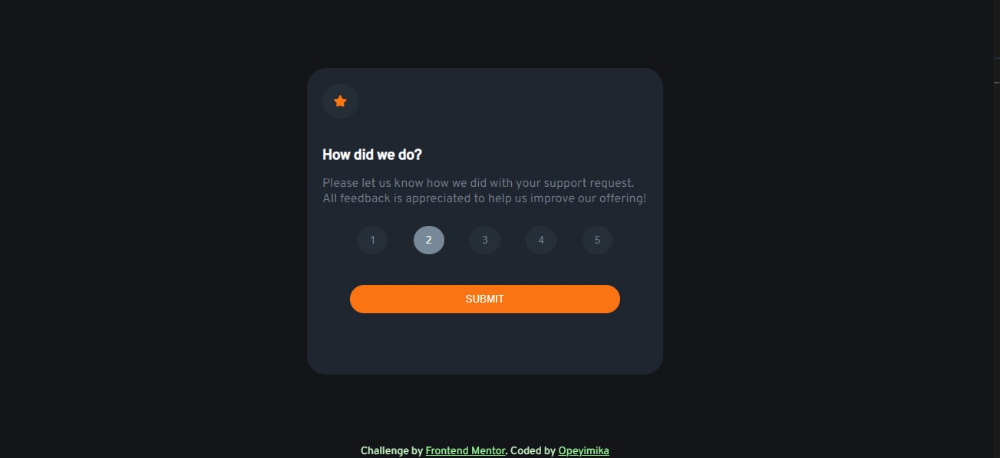
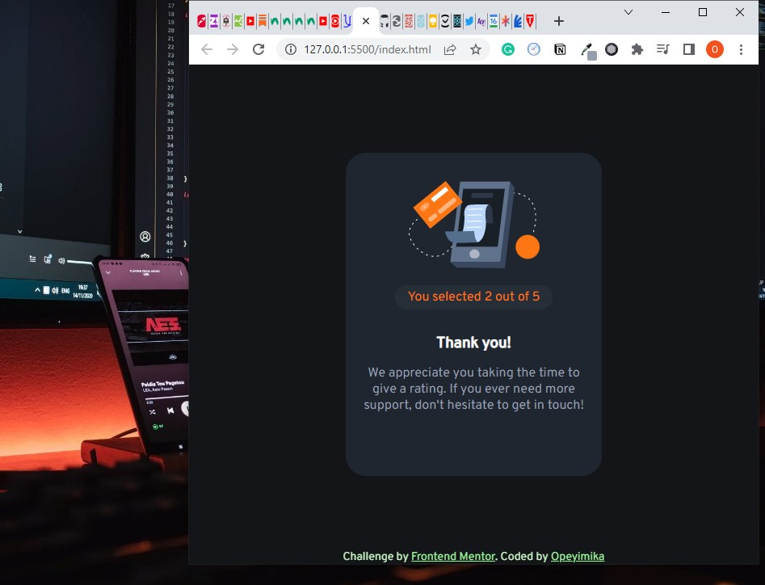

# Frontend Mentor - Interactive rating component solution

This is a solution to the [Interactive rating component challenge on Frontend Mentor](https://www.frontendmentor.io/challenges/interactive-rating-component-koxpeBUmI). 

### The challenge

Users should be able to:

- View the optimal layout for the app depending on their device's screen size
- See hover states for all interactive elements on the page
- Select and submit a number rating
- See the "Thank you" card state after submitting a rating

### Screenshot

### Links
- Live Site URL: (https://opeyimika-sudo.github.io/interactive-component-rating/)

### Built with

- Semantic HTML5 markup
- CSS custom properties
- Functions
- Loops
- Document Object Model Manipulation
